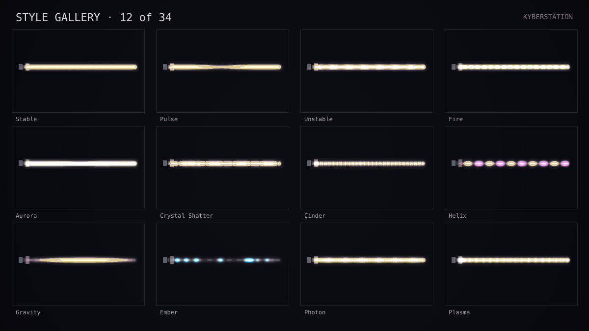
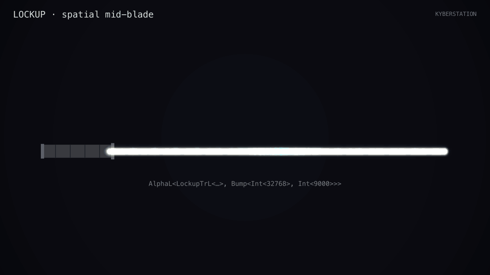
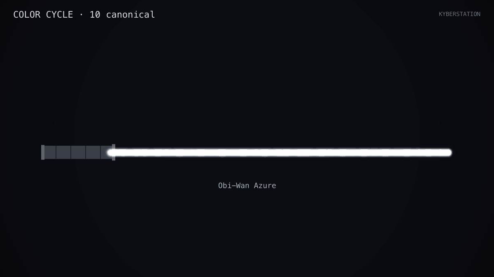
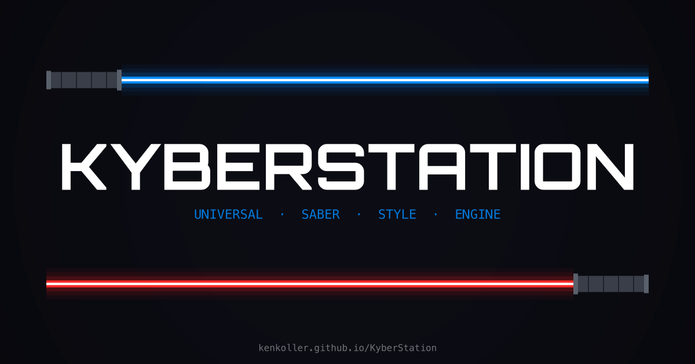

# KyberStation

### 🪐 [**Open KyberStation →**](https://kenkoller.github.io/KyberStation/)

**No install. Works in any modern browser.** Mobile, tablet, laptop, or desktop.

[](https://github.com/kenkoller/KyberStation/actions/workflows/ci.yml)
[](LICENSE)
[](https://github.com/kenkoller/KyberStation/issues/new/choose)

**Quick links:** [🚀 Try it](https://kenkoller.github.io/KyberStation/) · [Features](https://kenkoller.github.io/KyberStation/features) · [Showcase](https://kenkoller.github.io/KyberStation/showcase) · [Changelog](https://kenkoller.github.io/KyberStation/changelog) · [FAQ](https://kenkoller.github.io/KyberStation/faq) · [Gallery](https://kenkoller.github.io/KyberStation/gallery)



**Visual blade style editor, real-time simulator, and ProffieOS config generator for custom lightsabers.**

**Free · browser-based · MIT licensed · no accounts · no backend · hobby project · beta**

> **33** styles · **22** effects · **19+13** ignition/retraction animations · **336+** presets · **16** boards · **~5,000** tests

Design, preview, and export blade styles for Proffieboard, CFX, Golden Harvest, Verso, Xenopixel, and more. Works on any device — phone, tablet, laptop, or desktop. Installable as a PWA.

> Think "DAW for lightsabers" — if GarageBand let you design blade animations instead of music tracks.

> **Beta posture:** This is the first public release. KyberStation v1.0 is a **design tool first** — visual editor + simulator + ProffieOS code generator. To flash a generated config to a real Proffieboard, use the documented `dfu-util` workflow in [`docs/FLASH_GUIDE.md`](docs/FLASH_GUIDE.md). The in-browser WebUSB FlashPanel is shipped as experimental in v1.0; see the Flash section below.

## Features

### Blade Engine (150+ source files across packages, ~5,000 tests)

- **33 blade styles** — Stable, Unstable, Fire, Pulse, Rotoscope, Gradient, Photon, Plasma, Crystal Shatter, Aurora, Cinder, Prism, Painted, Image Scroll, Gravity, Data Stream, Ember, Automata, Helix, Candle, Shatter, Neutron, Torrent, Moire, Cascade, Vortex, Nebula, Tidal, Mirage, Darksaber, Sith Flicker, Blade Charge, Tempo Lock
- **22 effect types** — Clash, Lockup, Blast, Drag, Melt, Lightning, Stab, Force, Shockwave, Scatter, Fragment, Ripple, Freeze, Overcharge, Bifurcate, Invert, Ghost Echo, Splinter, Coronary, Glitch Matrix, Siphon, Unstable Kylo
- **19 ignition + 13 retraction animations** with 10 easing curves and custom easing support
- Multi-directional layer compositing with per-segment effect scoping
- Headless engine — zero DOM dependencies, runs in browser, tests, or Electron

### Combat Effects (live-triggerable, sustained or one-shot)



- **Click-to-trigger** any of 22 effects from the action bar (Clash, Lockup, Blast, Stab) or keyboard (`C`, `L`, `B`, `S`)
- **Sustained effects** (Lockup, Drag, Melt) hold while the trigger is held — the visualizer shows the live held state
- **Spatial placement** — blast position + radius, lockup pivot point, drag tail length all configurable
- **Modulation routing v1.1** — wire any of 11 modulators (swing, sound, angle, twist, time, clash, battery, lockup, preon, ignition, retraction) to any blade parameter via click-to-route, drag-to-route, or `fx`-button math expressions

### Code Generation
- AST-based ProffieOS C++ code emitter — balanced angle brackets, valid template nesting
- Full config.h generation with Layers<>, BlastL<>, InOutTrL<>, transitions, functions
- ProffieOS 7.x compilation validated via arduino-cli (23-preset config, 264 KB / 52% flash)
- Correct `SaberBase::` enum prefixes, `maxLedsPerStrip` placement, `CONFIG_PROP` section separation

### Multi-Board Support (16 boards)
- Proffieboard V2.2, V3.9, Lite, and Clone variants
- CFX, Golden Harvest V3/V4, Verso
- Xenopixel V2/V3, LGT, Asteria, Darkwolf, DamienSaber
- Board capability matrices with compatibility scoring per preset
- **Battery selector with manufacturer-spec discharge warnings** — pick from a catalog of common 18650 + 21700 cells; Hardware panel surfaces a safety warning when configured LED count exceeds the cell's continuous-discharge headroom
- **Vendor-reality blade length captions** — Hardware panel flags when configured LED count diverges from typical vendor practice for a given inch length

### Flashing your saber

> **The recommended path for v1.0 is the `dfu-util` command-line workflow** documented in [`docs/FLASH_GUIDE.md`](docs/FLASH_GUIDE.md). It includes a mandatory backup step that turns "I just bricked my saber" into "I just lost 30 seconds." Most Proffieboard owners already have a terminal and `arduino-cli` installed; this workflow takes about 10 minutes the first time and two commands every time after.

**Quick overview of the dfu-util path:**
1. Design your saber in KyberStation, export `config.h` from the OUTPUT panel.
2. Drop it into a ProffieOS source tree, point `ProffieOS.ino` at it, compile with `arduino-cli`.
3. Strip the `.iap` DFU suffix, enter DFU mode, **back up your existing firmware**, flash with `dfu-util`.

Full step-by-step instructions, vendor-customized-board warnings (89sabers, KR, Saberbay), and recovery procedure live in [FLASH_GUIDE.md](docs/FLASH_GUIDE.md).

**WebUSB FlashPanel (experimental, v1.0):**
- KyberStation also includes a one-click in-browser WebUSB FlashPanel.
- The protocol is implemented and verified against a comprehensive mock test suite, but on real hardware the manifest phase has a known issue that can leave the chip stuck in DFU mode after a successful write — particularly on vendor-customized boards (89sabers, KR, Saberbay, Vader's Vault).
- For v1.0, the FlashPanel is shipped behind an **EXPERIMENTAL** badge with a 3-checkbox disclaimer gate: you must acknowledge **(1)** responsibility for the flash, **(2)** that you have backed up your existing firmware via `dfu-util`, and **(3)** that you have a recovery plan. Proceed remains disabled until all three are checked.
- **Use the dfu-util workflow as your reliable path; treat the FlashPanel as an experiment.** The mandatory-backup acknowledgement turns "I just bricked my saber" into "I just lost 30 seconds."
- The manifest-phase fix is planned for v0.16+.

**Help us improve hardware coverage.** If you flash your saber and hit anything unexpected, please file a [hardware report](https://github.com/kenkoller/KyberStation/issues/new?template=hardware_report.md) with your saber vendor, board variant, OS, and what happened.

### Blade Topologies (8 configurations)
- Single, Staff, Crossguard, Triple, Quad-Star, Inquisitor Ring, Split Blade, Accent LEDs
- Per-segment effect scoping, ring rotation, configurable blade lengths (24"–40")

### Sound System
- Sound font parser and Web Audio playback engine
- SmoothSwing pair crossfade simulation
- **13 stackable audio filters** — LP/HP/BP, distortion, reverb, delay, tremolo, chorus, flanger, phaser, bitcrusher, pitch shift, compressor
- Dynamic filter parameters driven by swing speed, blade angle, twist, LFO, or noise
- 6 built-in filter chain presets

### User Presets & Collections
- One-click **Save Preset** from the action bar — snapshots the current config to your local library with auto-named entries
- "My Presets" sidebar section in the gallery with click-to-load, delete, and color swatches
- Save any blade configuration as a reusable preset in your personal library
- Tag, search, sort, duplicate, and organize presets
- Export/import preset collections as `.kyberstation-collection.json` bundles
- Thumbnail auto-capture from the blade canvas (engine-rendered MiniSaber preview)

### Font Library
- Directory picker scans your local sound font collection (Chromium browsers)
- Auto-detects format (Proffie, CFX, Generic), SmoothSwing pairs, completeness
- Load, pair with presets, and persist folder selection across sessions via IndexedDB

### Saber Profiles & Card Presets
- Create named saber profiles with multiple card configs ("Dueling Set", "Display Set")
- **Inline rename + private workbench notes + description** per profile — keep build journals or vendor notes attached to a saber without exposing them in the generated config
- **Click-to-rename card presets** in the queue — quick relabel without opening a modal
- One-click **Add to Queue** from the action bar — drops the current config into the active profile's card queue with auto-generated name
- Card Preset Composer — add from Gallery, My Presets, or current editor state
- 4 built-in starter templates (OT Essentials, Prequel Collection, Dark Side Pack, Dueling Minimalist)
- Storage budget estimation per preset entry with real font sizes when library connected
- SD Card Writer — generate a ZIP with config.h and font directories, ready to extract

### Gallery



- **336+ character presets** across canon, Legends, kinetic-style cuts, and pop-culture sources (LOTR, Marvel, DC, Zelda, mythology, anime, gaming, kids' cartoons, Power Rangers, mascots)
- **Grid view as default** with view toggle, color/style/era filter rail, click-to-open detail modal showing full config + load/share actions
- Every preset is `continuity`-tagged so you can filter to just canon
- Surprise Me randomizer pulls from the full ignition + retraction + modulation catalogs

### Sharing
- Kyber Code system — compact config URLs with deflate compression + base64url encoding
- Single config, preset collection, and card template import/export
- Animated GIF export (idle hum loop + ignition cycle) and 1200×675 share-card PNG with QR scan-to-open

### Accessibility
- Reduced motion auto-sync from OS `prefers-reduced-motion`
- Keyboard-only drag-and-drop alternative (Alt+Arrow keys)
- ARIA labels, focus traps, and color-only indicator text fallbacks
- Responsive grid layouts, 44px minimum touch targets
- 9 scene themes for full UI theming

### Desktop Workbench Layout
- Horizontal blade canvas with multi-column panel workspace below
- Responsive 1–4 column grid (adapts to viewport width)
- Drag-and-drop panel reordering between columns via HTML5 DnD
- Saveable layout presets — create, load, delete custom arrangements
- Header bar with undo/redo, FPS counter, share (Kyber Code), global pause, settings

### Mobile Shell
- **Vertical-stack layout with sidebar drawer** at 375px and up — purpose-built for phones, not a squashed desktop
- Bottom tab bar for primary navigation between editor, gallery, and saved sabers
- Full editing parity for color, style, and effect tuning — design a saber from your phone

### Marketing Pages
- **`/features`** — long-form ledger of 10 feature pillars with deep-link anchors and inline ProffieOS code peeks
- **`/showcase`** — curated 20-saber tour grouped JEDI / SITH / STYLE / CROSS, click-through to editor via Kyber Code
- **`/changelog`** — auto-rendered from `CHANGELOG.md` with per-release anchors
- **`/faq`** — 13 entries answered in the humble hobby-project tone, native `<details>`/`<summary>`

### Visualization Stack & Debug Mode
- 13 toggleable analysis layers below the blade canvas (pixel strip, R/G/B channels, luminance, power draw, hue, saturation, effect overlay, swing response, transition progress, storage budget)
- Per-pixel debug overlay: hover for RGB/hex/HSL/mA/SW color name, click to pin info cards, range selection
- Visualization toolbar with quick-toggle icons for each layer

### Fullscreen Preview
- Immersive blade preview with auto-hiding controls
- Horizontal and vertical blade orientations
- Mobile device motion support (accelerometer/gyroscope drives swing speed and blade angle)
- Full keyboard shortcut support for effect triggers

### Settings & Customization
- Performance tiers: Full, Medium, Lite (via CSS class system)
- Aurebesh mode: Off, Labels, Full (toggle all UI text to Star Wars script)
- UI sounds: Star Wars-style beep/chirp feedback with Web Audio synthesis (default off)
- 30 scene themes (9 base + 21 extended) with material, corner, border, and ambient properties
- Global pause toggle freezes all animations app-wide
- Undo/redo with 50-entry history and human-readable labels

## Status



### v0.16.0 — Launch (2026-04-30)

The first publicly-released version. Includes:
- **Save Preset + Add to Queue** action-bar buttons — one-click flow from "I built something" to "it's saved" or "it's on a card"
- **Battery selector with manufacturer-spec power warnings** — pick from a catalog of common 18650 / 21700 cells; Hardware panel surfaces a safety banner when LED count outruns the cell's continuous-discharge headroom
- **Profile rename + private workbench notes + description** — keep build journals attached to a saber without exposing them in the generated config
- **Gallery grid view** as default, with click-to-open detail modal and color/style/era filter rail
- **Mobile shell** — vertical-stack layout with sidebar drawer, designed for 375px and up
- **Marketing pages** — `/features`, `/showcase`, `/changelog`, `/faq` for visitors who want context before opening the editor
- Full **Modulation Routing v1.1 Core** — 11 modulators (swing/sound/angle/twist/time/clash/battery/lockup/preon/ignition/retraction), click-to-route + true HTML5 drag-to-route, per-binding expression editing via `fx` button popover, reciprocal hover highlighting, AST-level template injection in codegen so the generated `config.h` flashes LIVE ProffieOS templates instead of snapshot values
- **4 new engine effects** — Sith Flicker (unstable-weapon flicker), Blade Charge (visible buildup), Tempo Lock (beat-locked rhythm), Unstable Kylo (crossguard pulse)
- **27 new kinetic-style presets** for the Surprise Me / kinetic gallery filter
- **Vertical Saber Card layout** + 4 layouts × 5 themes (20 combos) for share-card export
- **Animated saber GIF export** — idle hum loop + ignition cycle from the My Crystal panel, headless workbench renderer port
- **336+ character presets** across canon, Legends, kinetic-style cuts, and pop-culture sources (LOTR, Marvel, DC, Zelda, mythology, anime, gaming, kids' cartoons, Power Rangers, mascots) — every preset is `continuity`-tagged so you can filter to just canon
- **AST-based ProffieOS code generator** — emits balanced templates that compile against ProffieOS 7.x without modification
- **`dfu-util` workflow as the recommended flash path** ([docs/FLASH_GUIDE.md](docs/FLASH_GUIDE.md)) with mandatory firmware backup; in-browser **WebUSB FlashPanel as experimental** behind a 3-checkbox disclaimer gate
- **Kyber Glyph v2 sharing** — `?s=<glyph>` URL handler round-trips full configs including modulation bindings; v1 / v2 backward compatible

See the [CHANGELOG](CHANGELOG.md) for the full Added / Changed / Fixed list and the prior version entries.

### Phase 1 Bug Fixes (Complete)
- Stutter ignition timing corrected
- Crystal Shatter retraction animation fixed
- Photon/pixel render sync resolved
- Responsive breakpoints tuned for mobile and tablet viewports
- Hex color input added to the color panel
- Gallery preset tag contrast improved for readability
- Canvas RGB graph improvements: Y-axis labels, consistent spacing

### ProffieOS Codegen Validation (Complete)
- Generated config.h compiles against ProffieOS 7.x without modification
- 23-preset config compiled successfully (264 KB, 52% of available flash)
- Validated via `arduino-cli` with Proffieboard V3 FQBN

### Phase 4-5: UI Redesign & New Effects (Complete)
- Desktop workbench layout with responsive multi-column panels replacing sidebar
- Visualization stack with 13 analysis layers and per-pixel debug mode
- 24 new engine effects (Phase 4): 8 styles, 7 effects, 5 ignitions, 4 retractions
- Fullscreen preview with device motion support for mobile
- Global pause system, undo/redo history, share via Kyber Code URLs
- Settings modal with performance tiers, Aurebesh mode, UI sounds, layout presets
- Hardware defaults corrected: LED count 132→144, volume 2000→1500, zoom constrained
- 30 scene themes with material/corner/border CSS properties

### Phase 6: Engine Expansion (Complete)
- 13 new engine components: 7 styles (Torrent, Moire, Cascade, Vortex, Nebula, Tidal, Mirage), 6 effects (Invert, Ghost Echo, Splinter, Coronary, Glitch Matrix, Siphon), 3 ignitions (Hyperspace, Summon, Seismic), 3 retractions (Implode, Evaporate, Spaghettify)
- Engine totals: 33 styles, 22 effects, 19 ignitions, 13 retractions (87 animation components)

### v0.11.1: Landing Page + Design Review Polish (Complete)
- Replaced `redirect('/editor')` with a real first-impression landing: live BladeEngine hero (4 iconic preset rotation: Luke ROTJ, Anakin, Kylo Ren, Ahsoka), value strip, CTAs, release strip, footer.
- Full design-audit polish pass shipped: alert-color token discipline (raw hex replaced with `rgb(var(--*))` theme tokens), skeleton + error-state coverage across async panels, colour-glyph pairing via new `<StatusSignal>` primitive for colorblind redundancy.
- `.reduced-motion` class and `@media (prefers-reduced-motion: reduce)` now both hide ambient decorations (opacity: 0) instead of just stopping animation, matching the behaviour of `.ambient-off`.
- CI infrastructure fixes: lint scripts replaced with a clearly-labeled placeholder (eslint was referenced but never installed); `/editor` and `/m` pages now wrap `useSearchParams()` in Suspense to satisfy static prerender under `output: 'export'`.

### v0.11.2: Color Naming Math (Complete)
- Colour picker name display rewritten as a three-tier algorithm (`apps/web/lib/namingMath.ts`): ~147 landmark HSL points (every curated name preserved + 42 additions across yellow-green / indigo / Legends deep-cuts) → 10-modifier grammar (`Pale`, `Deep`, `Vivid`, `Muted`, `Dawn-`, `Dusk-`, `Shadowed`, `Bleached`, `Ember-`, `Frost-`) → coordinate-mood fallback (`{Mood} {Sector} {HEX}-{HEX}`).
- Fine-adjustment variety fixed: small nudges in the colour picker now produce different names instead of repeating the same landmark.
- `"Unknown Crystal"` fall-through removed — every RGB now returns a distinctive, in-universe name (verified across 2,000-RGB random scan).
- 83 new tests pinning determinism, coverage, modifier precedence, landmark preservation, and mood-word length budget. `saberColorNames.ts` is now a thin re-export shim so existing callers (`ColorPanel`, `PixelDebugOverlay`) need no changes.

## Quick Start

### Prerequisites
- Node.js 20+
- pnpm 9+

### Install & Run

```bash
git clone https://github.com/kenkoller/KyberStation.git
cd KyberStation
pnpm install
pnpm dev
```

Open [http://localhost:3000](http://localhost:3000) in your browser. You'll
land on the identity page — click **Open Editor** to start building, **Launch
Wizard** for a guided 3-step onboarding, or **Browse Gallery** to jump straight
to curated presets.

## Development

```bash
pnpm dev              # Start dev server
pnpm build            # Build all packages + app
pnpm test             # Run all tests (Vitest)
pnpm test:engine      # Engine tests only
pnpm test:codegen     # Codegen tests only
pnpm lint             # ESLint check
pnpm typecheck        # TypeScript strict check
```

## Architecture

Monorepo powered by pnpm workspaces. Engine-first design — the simulation engine is the source of truth, and the UI is a thin rendering layer.

```
kyberstation/
├── apps/web/              # Next.js 14 web application (App Router)
│   ├── app/               # Pages: landing, editor, share link handler
│   ├── components/        # Editor panels, shared UI, layout
│   ├── hooks/             # useBladeEngine, useAnimationFrame, etc.
│   ├── stores/            # Zustand stores (13 total: blade, ui, layout, layer, visualization, history, userPreset, presetList, saberProfile, audioFont, audioMixer, accessibility, timeline)
│   └── lib/               # Config I/O, Kyber Code encoding, IndexedDB
├── packages/engine/       # Headless blade simulation engine
│   ├── styles/            # 29 style implementations
│   ├── effects/           # 21 effect types
│   ├── ignition/          # 19 ignition + 13 retraction animations
│   ├── functions/         # ProffieOS function emulators
│   └── motion/            # IMU/motion simulation
├── packages/codegen/      # AST-based ProffieOS C++ code generator
├── packages/presets/      # Character preset library (all eras)
├── packages/sound/        # Sound font parser, player, filter chain
├── packages/boards/       # 16 board profiles + compatibility scoring
├── scripts/               # local-build.mjs, local-dev.mjs (no-Turbo runners)
└── docs/                  # Architecture, contributing, ProffieOS reference
```

## Tech Stack

| Layer | Technology |
|-------|-----------|
| Framework | Next.js 14 (App Router) |
| Language | TypeScript (strict mode) |
| UI | React 18, Tailwind CSS, Radix UI |
| State | Zustand |
| Rendering | HTML5 Canvas 2D |
| Audio | Web Audio API |
| Code Generation | Custom AST → C++ emitter |
| Storage | IndexedDB (Dexie.js) — fonts, presets, profiles, library handles |
| Testing | Vitest + React Testing Library |
| Build | pnpm workspaces (Turborepo optional) |

## Feedback

KyberStation is a hobby project built by one person. Outside pull requests are
not currently accepted while the project is still taking shape — this policy
will likely change as things stabilize. In the meantime, bug reports, feature
ideas, and style requests are the most useful way to help.

- **Bug reports** — [File an issue](https://github.com/kenkoller/KyberStation/issues/new?template=bug_report.md)
- **Feature requests** — [File an issue](https://github.com/kenkoller/KyberStation/issues/new?template=feature_request.md)
- **New blade styles or presets** — [File a style request](https://github.com/kenkoller/KyberStation/issues/new?template=style_request.md)
- **Questions & discussion** — [GitHub Discussions](https://github.com/kenkoller/KyberStation/discussions)

The [Contributing Guide](docs/CONTRIBUTING.md) documents the repo structure and
how new styles, effects, boards, and presets are added — useful reference even
if you can't submit a PR yet. This project follows a [Code of Conduct](CODE_OF_CONDUCT.md).

## License

**KyberStation** itself is [MIT](LICENSE)-licensed.

### Upstream acknowledgements

- **ProffieOS** (the firmware this tool targets) is licensed under
  [GNU GPL-3.0](LICENSES/ProffieOS-GPL-3.0.txt). KyberStation does not
  contain any ProffieOS source code; it emits C++ configs intended to be
  compiled *into* ProffieOS. When a user compiles a generated config and
  distributes the resulting firmware, GPL-3.0 obligations apply to that
  combined work — most importantly, the Corresponding Source (including
  the generated config) must be made available to recipients.
  KyberStation's emitter includes a GPL-3.0 attribution header in every
  generated `config.h` to make this relationship explicit.
- **Community style snippets** committed under
  `packages/codegen/tests/fixtures/fett263/` are GPL-3.0 derivatives of
  ProffieOS examples (mostly Fett263's published style library). They are
  kept in a dedicated subdirectory with their own attribution comments;
  see that folder's `README.md` for the contribution policy. The rest of
  KyberStation remains MIT.

### Credits & Thanks

KyberStation stands on the shoulders of years of saber-community work. Massive thanks to:

- **[Fredrik Hübinette](https://fredrik.hubbe.net/)** — creator of ProffieOS and the Proffieboard hardware. Without ProffieOS, this tool wouldn't exist. The whole Neopixel saber community owes him.
- **[Fett263](https://fett263.com/)** — the Style Library, edit-mode conventions, dual-mode ignition pattern, and prop file work that KyberStation's codegen targets. Most of what KyberStation generates is a visual editor for things Fett263 figured out.
- **The [Crucible](https://crucible.hubbe.net/) and Proffieboard communities** — the Q&A archive, the troubleshooting threads, the patient answers to beginner questions. Real reference material.
- **The saber vendors** (89sabers, KR Sabers, Saberbay, Vader's Vault, and others) — for shipping the hardware that makes this hobby possible.
- **The font makers** (Kyberphonic, Greyscale, and the many ProffieOS-format font authors) — the audio half of every saber.

KyberStation is a hobby project. It exists because of the work above.
