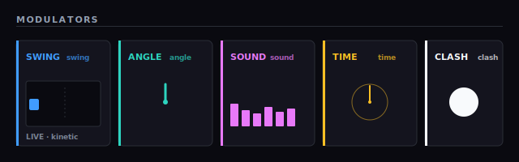
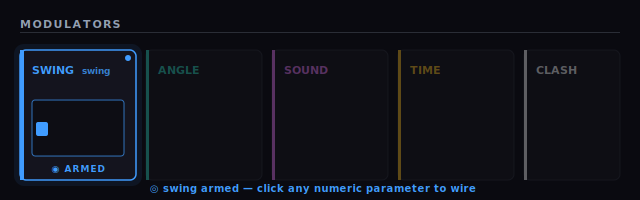
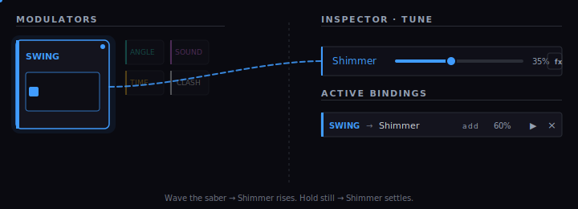

# Your First Wire in 30 Seconds

> **BETA** — v1.0 ships "Routing Preview": 5 modulators, click-to-route, ProffieOS V3.9 / Golden Harvest V3 flash. Math expressions, 6 more modulators, drag-to-route, and glyph sharing land in v1.1. See the [roadmap](../../MODULATION_ROUTING_ROADMAP.md).

---

You're about to make your blade react to a swing. One wire. Once you've made one, you can make a hundred.

## What you'll build

A blade whose **shimmer** reacts when you **swing**. Hold still and it's calm. Swing it and it comes alive.

---

## Step 1 — Find the SWING plate

Open the **DESIGN** tab. In the **LayerStack** panel on the left, find the **SWING** row. Its needle twitches when you move your mouse or wave your phone.

That needle is the live `swing` signal — the same one your finished blade will feel when you duel.

## Step 2 — Arm the SWING plate

Click the **SWING** plate. It highlights with a soft glow. That's your cue: SWING is **armed** and ready to wire.

Like picking up a patch cable. One end's in your hand. Now plug it in.

## Step 3 — Click the shimmer knob

In the **Inspector** on the right, open the **TUNE** tab and click the **shimmer** knob.

A wire appears. The knob glows the same color as the plate.

**Wave your phone or shake your mouse.** The blade responds — shimmer rises with every swing, settles when you hold still.

That's modulation. One wire.

---

## What else can you do?

- **`sound → baseColor.b`** — blade gets bluer when you speak. Music-sync starter. [Recipes](./recipes.md).
- **`angle → baseColor.r`** — glows hotter when you point it up. [Recipes](./recipes.md).
- **`time → shimmer`** — slow rhythmic breathing, no gestures needed. [Recipes](./recipes.md).
- **Try different combinators** — Add layers on top of the base value; Replace overrides it. [Combinator Cookbook](./combinators.md).
- **Stack bindings** — route swing *and* sound to shimmer at once. Loudest wins. [Combinator Cookbook](./combinators.md).

## Your editor looks different?

If you don't see a ROUTING tab or modulator plates, check your board:

- **CFX / Xenopixel / Verso** — modulation is hidden. These boards don't support runtime routing. Preview still works, but modulation won't flash.
- **Proffieboard V2.2** — disabled for v1.0; full V2 support lands in v1.1.
- **Proffieboard V3.9 / Golden Harvest V3** — full support. Look for `BOARD · PROFFIE V3.9 · FULL` in the StatusBar.

Switch boards from the StatusBar badge or the blade creation wizard.

---

> **Next steps**
> - Browse the 5 starter recipes in the **Gallery** tab — pre-wired and ready to remix
> - Click any wire to tune its **amount** and **combinator**
> - Hit **EXPORT** to flash it to your saber

---

<!--
  The three images above are hand-authored animated SVGs. They play
  natively in any browser renderer, match the editor's color tokens
  (--mod-swing / --mod-sound / etc.), and stay version-control
  friendly (text, diffable, <20 KB combined).

  Swap for screen-recorded GIFs post-launch if you want true UI
  fidelity. Recording notes for the replacement pass:
    - Record on desktop (1600×1000), Tune tab active.
    - GIF 1: LayerStack plate bar in resting state — 3s loop showing
      the live CSS animations (swing needle bouncing, sound VU
      dancing, clock sweeping, clash flashing).
    - GIF 2: Click the SWING plate, hold the armed state ~2s,
      showing the highlight transition + "swing armed" banner.
    - GIF 3: With Swing armed, click the Shimmer label in the Tune
      tab; the row should tint swing-blue and the binding should
      appear in ACTIVE BINDINGS.  ~4-5s, wider framing so both
      panels are visible.
-->

